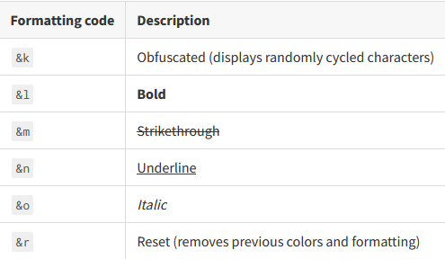

# 颜色

可以在所有的文本中使用颜色和颜色代码

## RGB颜色

> 自定义颜色仅适用于Spigot 1.16或更高版本，并且只有客户端在Minecraft 1.16或更高版本上才能正确显示

使用十六进制颜色格式显示自定义颜色：`&#<HEX color>`。HEX颜色必须恰好由6个十六进制字符组成（0123456789abdedf，不区分大小写）。

HEX颜色选择器可以帮助找到正确的颜色代码，例如[这个](https://www.w3schools.com/colors/colors_picker.asp)

例子: `/hd create example &#FF87D1Pink`

## 标准色表

## 标准格式代码

